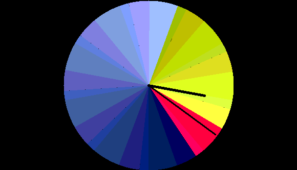
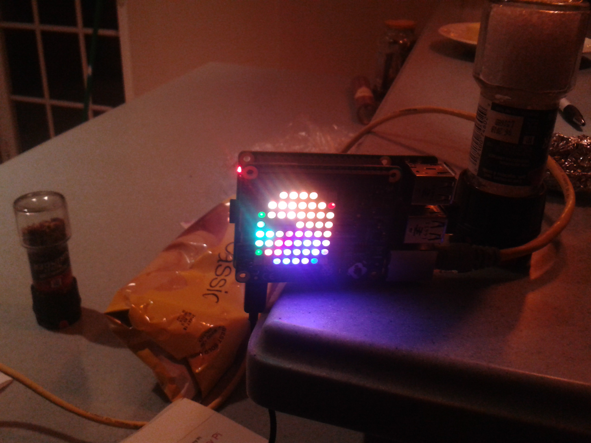

.. title: Guido's clock and the Raspberry Pi Sense Hat
.. slug: guidos-clock-and-the-raspberry-pi-sense-hat
.. date: 2016-01-08 19:17:42 UTC
.. tags: raspberry pi, python, sense hat, mclock2
.. category: 
.. link: 
.. description: raspberry pi sense hat and pretty clocks
.. type: text

=============
Guido's clock
=============

Many years ago I was working a simple app to run on a Nokia Series 60
phone.

It was actually before phone apps were really a thing, or even called
apps.  Nokia had ported python to the Series 60 phones and had some
simple libraries you could use to build your Nokia apps.

I created one called `anorak`_.  Around the same time Guido Van Rossum
posted some code to a thing he called `mclock2`_.  Growing up his
family had a clock which had three coloured discs and a bright light
behind them.  The disks rotate through the day giving pretty patterns
on the clock.  The clock was designed by Rob Juda.

Here is a screenshot from Guido's code.

Guido created a Tkinter application to simulate the clock.  I liked
the clock, so ported it to Series 60 and used it as the default screen
for *anorak* which was a sort of poorman's GPS using cell tower
locations to figure out where I was.  

Fast-forward to today and there is the Raspberry Pi and the Sense Hat.

The latter is on the International Space Station.  It plugs into the
pins on a pi and has:

* Gyroscope
  
* Accelerometer
  
* Magnetometer
  
* Temperature
  
* Humidity
  
* Barometric pressure

In addition it has an 8x8 coloured LED array.

I am working on hooking all this up to my moped and wanted to learn
about to use the `sense hat python interface`_.

The interface is simple to use, just import the library and create a
SenseHat object and then you can talk to the device.

I could not find a drawing library to draw directly onto the 8*8 pixel
grid.  Instead I used PIL and ImageDraw.Draw.

This allowed me to create a 64x64 image with PIL, with very few
changes to the code.  I just needed the ImageDraw.Draw().pieslice
method.

Now to get down to 8*8 I just divided the image into an 8*8 grid with
8*8 pixels in each grid point.

I then just take the average pixel value and use hat.set_pixel() to
set that value.

The hands of the clock did not work too well.  In the end I made the
hour hand all black with a 10 pixel wide line.  The minute hand I did
in white, again 10 pixels wide.

Here is a photo of the end result.

So, not quite as neat as the Tkinter version, but I have found I can
actually figure out the time from this thing.

*UPDATE:*

I thought I might be able to do add new method to create pixels.  I am
creating a 64 * 64 image using the Python Imaging Library tools.

    
This one uses a weighted average based on Euclidean distance from the
center of the 8 * * area being averaged.  The resulting clock is
looking prettier now.
    
Currently the hands are being drawn as 12 pixels wide lines, with a
black hour hand and a red minute hand.
    
Depending on what is going on with the coloured disks the time is
usually quite easily readable.  Sometimes you have to wait a few
seconds if there is a lot of red or dark colour on the clock, before
you can find the hands.

It is a fun little clock when you only need approximate time.

Sensors
-------

I have been playing with these a little.  I have a simple monitor
function that can be used to send data from the sensors to the pixel
display.

The temperature sensor is a little too close to the pi's processor, so
it is affected by the heat from the processor.  `This topic`_ on the
raspberry pi forum had some helpful suggestions.

There are two temperature sensors on the board. One with the humidity
sensor and one with the pressure sensor.  They are different distances
from the pi processor.

The incantation below can be used to get the CPU temperature.::

   vcgencmd measure_temp

With these three numbers it should be possible to find a reasonable
formula to get a good approximation of the real temperature.  To do
this I will just have to collect some data to fit a model to.

Joy Stick
---------

I am yet to experiment with this.  I suspect it will be fairly easy to
set something up so I can use it to switch between different displays.

Storing Readings
----------------

This is also on the list.  Once I have this working I'll be able to
collect data as I am driving around Bermuda.  This will include data
from the accelerometer and the compass.  

Raspberry Pi Forum
------------------

There is a `raspberry pi forum index`_ which has some forums for a
wide range of subjects, including the AstroPy, the other name for the
Sense Hat.
           

.. _anorak: http://anorak.sourceforge.net/

.. _mclock2: https://www.python.org/~guido/mclock2.py

.. _sense hat: https://www.raspberrypi.org/products/sense-hat/

.. _code for mclock2 on sense hat: https://github.com/openbermuda/fishnet/blob/master/mclock2.py

.. _sense hat python interface: https://github.com/RPi-Distro/python-sense-hat

.. _this topic: https://www.raspberrypi.org/forums/viewtopic.php?f=104&t=111457

.. _raspberry pi forum index: https://www.raspberrypi.org/forums/index.php
